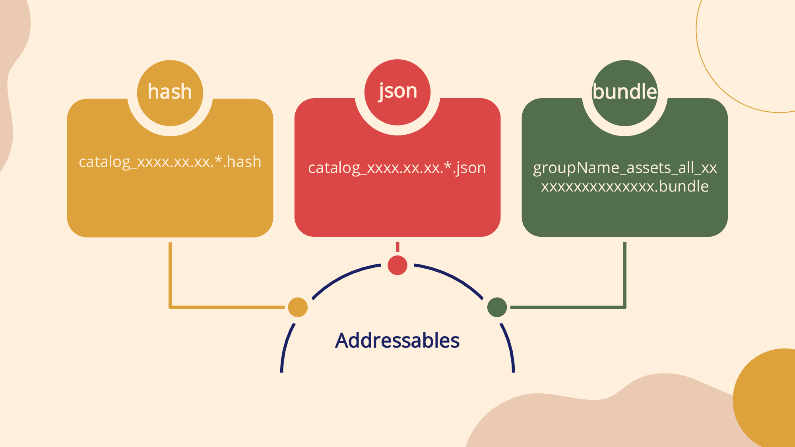
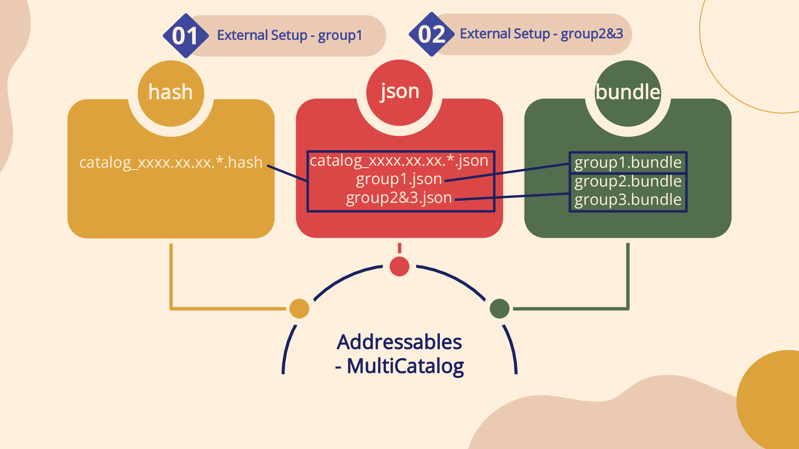
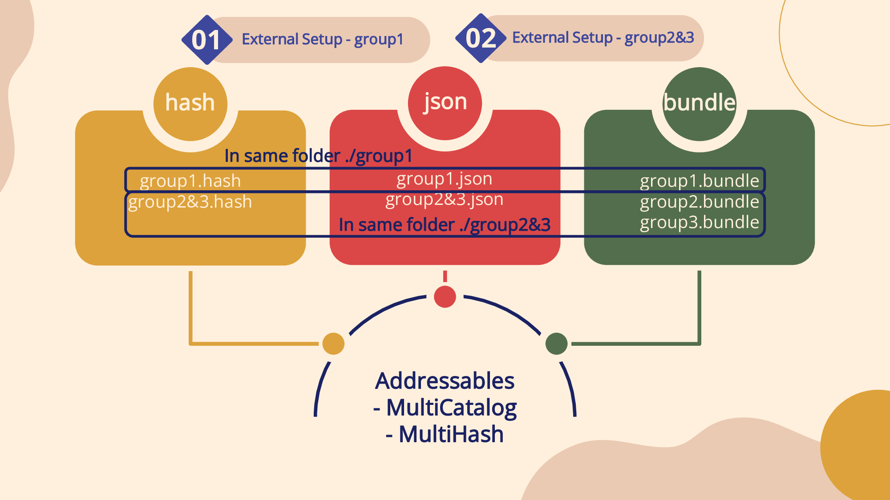
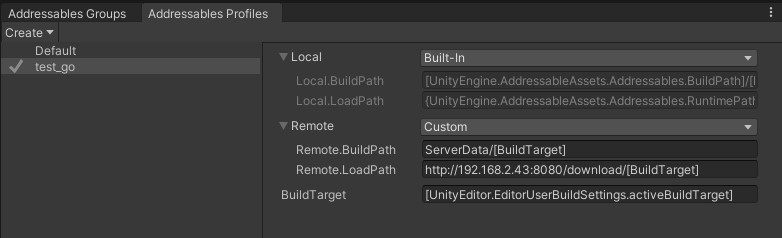
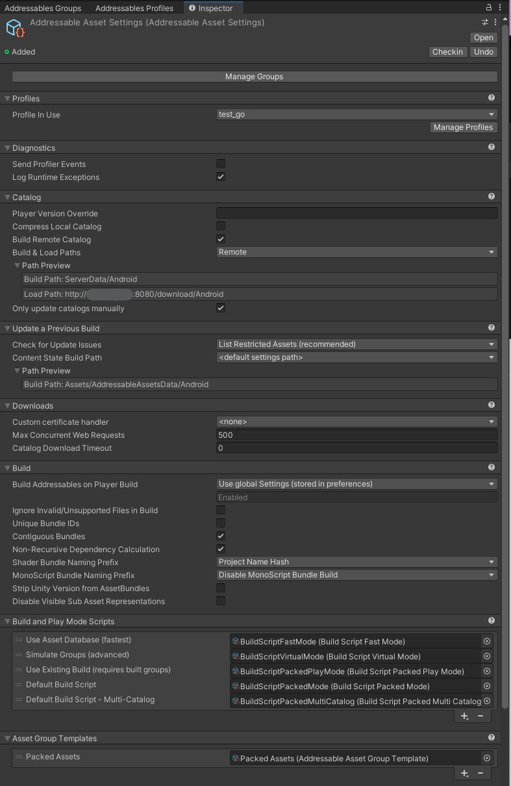
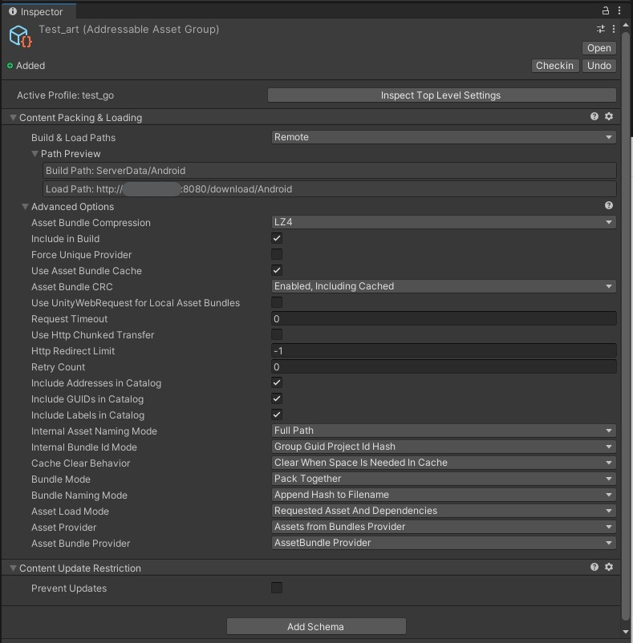
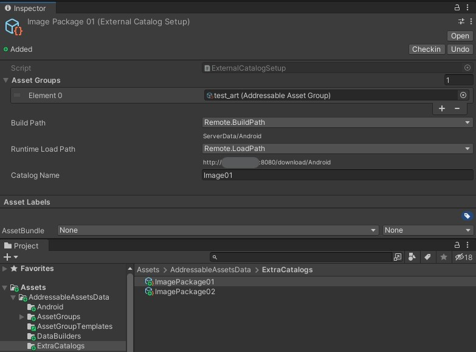
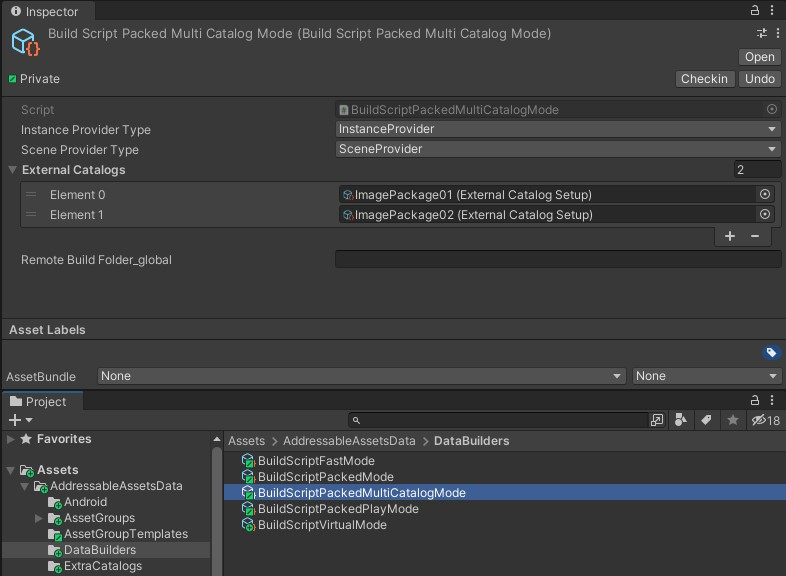

# Addressables - Multi-Catalog - Multi-Hash

**Note**: 保留了部分原项目 <https://github.com/juniordiscart/com.unity.addressables> 中的说明，添加了修改后新的功能与使用方法的说明。

该项目与原项目的区别在于，可以在打包生成 Multi - Catalogs 的同时生成 Multi - Hashes。由于每个 catalog 对应单独的 hash 文件而非所有 catalog 由单一 hash 文件标识，当个别 catalog 文件对应的 group 内资源被修改时，只有被修改的资源所在的 group 会被重新打包，不会再重新打包所有资源，因此大大提高了使用 Unity Addressables 实现热更新技术时的打包效率。

The Addressables package by Unity provides a novel way of managing and packing assets for your build. It replaces the Asset Bundle system, and in certain ways, also seeks to dispose of the Resources folder.

This variant forked from the original Addressables-project adds support for building your assets across several catalogs in one go and provides several other benefits, e.g. reduced build times and build size, as well as keeping the buildcache intact.

This package currently tracks version `1.21.9` of the vanilla Addressables packages. Checkout a `multi-catalog` tag if you require a specific version.

**Note**: this repository does not track every available version of the _vanilla_ Addressables package. It's only kept up-to-date sporadically.

For additional features found in this fork of Addressables, check the [Additional features](#additional-features) section.

## The problem

A frequently recurring question is:

> Can Addressables be used for DLC bundles/assets?

The answer to that question largely depends on how you define what DLC means for your project, but for clarity's sake, let's define it this way:

> A package that contains assets and features to expand the base game. Such a package holds unique assets that _may_ rely on assets already present in the base game.

So, does Addressables support DLC packages as defined above? Yes, it's supported, but in a very crude and inefficient way.

In the vanilla implementation of Addressables, only one content catalog file is built at a time, and only the assets as defined to be included in the current build will be packed and saved. Any implicit dependency of an asset will get included in that build too, however. This creates several major problems:

* Each content build (one for the base game, and one for each DLC package) will include each and every asset it relies on. This is expected for the base game, but not for the DLC package. This essentially creates unnecessary large DLC packages, and in the end, your running game will include the same assets multiple times on the player's system, and perhaps even in memory at runtime.
* No build caching can be used, since each build done for a DLC package is considered a whole new build for the Addressables system, and will invalidate any prior caching done. This significantly increases build times.
* Build caching and upload systems as those used by Steam for example, can't fully differentiate between the changes properly of subsequent builds. This results in longer and larger uploads, and consequently, in bigger updates for players to download.

## The solution

The solution comes in the form of performing the build process of the base game and all DLC packages in one step. In essence, what this implementation does is, have the Addressables build-pipeline perform one large build of all assets tracked by the base game and each of the included DLC packages.

Afterwards, the contents for each external catalog are extracted to their proper location and their content catalog file is created based on the content they require.

## Installation

该软件包最好使用 Unity 的Package Manager安装。在package manager的输入框中填写下方 git-tracked 包的 URL:

> <https://github.com/Heeger0/com.unity.addressables-MultiCatalog-MultiHash.git>

### Updating a vanilla installation

当您已经在项目中设置了 Addressables 并调整了设置以满足项目的需求时，将所有内容设置回原样可能会很麻烦。在这种情况下，最好使用新对象更新现有设置，而不是从头开始:

1. 从 Unity Package manager 中删除当前安装的 Addressables 包，并按照 [Installation section](#installation) 跟踪此版本。 但是，**不要删除**你项目中的  `Assets/AddressableAssetsData` 文件夹！

   > Window → Package Manager → Addressables → Remove

2. 在你项目的 `Assets/AddressableAssetsData/DataBuilders` 文件夹中，新建一个 'multi-catalog' data builder:

   > Create → Addressables → Content Builders → Multi-Catalog Build Script

   

3. 选择现有的 Addressable asset settings `Assets/AddressableAssetsData/AddressableAssetSettings`， 找到 `Build and Play Mode Scripts` 属性并将新创建的 multi-catalog data builder 添加到列表中。

   

4. 另外，如果你把 Addressables build 设置为由 player build 触发，或者有自定义的 build-pipeline，则必须设置 `ActivePlayerDataBuilderIndex` 属性。该值必须通过 debug-inspector 视图设置 (它不显示在自定义的inspector中)，或者通过脚本对它进行设置。

   

### Setting up Addressables Profiles, Settings and Groups

由于该扩展工具的打包逻辑限制，每个 Addressables Group 的 Build&Load Paths 必须设置为 Remote。
若原项目中所有 Group 的 Build&Load Paths 已经设置为 Remote，该步骤可忽略。

1. 打开 `Addressables Profiles` 窗口，创建一个自定义配置文件（文件名任意）:

   > Create → Profile

   打开新的配置文件，Remote 对应的下拉框修改为 Custom （默认为Built-In），对应属性修改为:
   Remote.BuildPath : `ServerData/[BuildTarget]`
   Remote.LoadPath : `服务器远程加载路径/[BuildTarget]`

   > 右键点击新的配置文件 → Set Active

   

2. 修改 Settings 设置:

   Profiles → Profile In Use → 选中新的配置文件

   勾选 Build RemoteCatalog

   Build & Load Paths 使用 Remote，Path Preview 下显示为自定义的 Build & Load Path

   勾选 Only update catalogs manually

   

3. 修改 Addressables Groups 设置:

   点击每个创建出的 Group，检查 Inspector 窗口内 Active Profile 是否为自定义的 profile，检查 Build & Load Paths 是否与 Settings 内的一致

   

### Setting up multiple catalogs

安装 multi-catalog 系统后，现在可以创建 additional catalogs 并将它包含在build中:

1. 在 `Assets/AddressableAssetsData` 文件夹下创建 `ExtraCatalogs` 文件夹，文件夹名**必须一致**。

2. 根据打包需求创建新的 `ExternalCatalogSetup` 对象:

   > Create → Addressables → new External Catalog

   该文件命名可自定义，不影响打包出的资源文件名。

3. 在创建的对象中填入以下属性:
   * Catalog name: build 过程中生成的 catalog 文件名。该文本即为打包后对应路径内生成的文件夹名，也是相应的json和hash文件名。打包后如需再次修改请删除打包出的文件并在修改后重新打包。
   * Build path: 构建完成后，此目录及其资源文件将导出到其中。**该工具仅支持将其设置为 Remote.BuildPath**
   * Runtime load path: 当游戏运行时，这些资源应该从哪里加载，这应该取决于您如何在玩家的系统上部署资源文件。**该工具仅支持将其设置为 Remote.BuildPath**

   

4. 分配属于此package的 Addressable asset groups。

   **Note**: 请确保所有 groups 的 Build&Load Paths 均为 Remote。

5. 选择 `BuildScriptPackedMultiCatalogMode` data builder 并分配 external catalog object(s)。

   

## Building

至此，一切准备就绪，可以正式进行打包操作。

打开 Addressables Groups 窗口:

> Play Mode Script → Use Existing Build (*) （*即为编辑器内当前平台）

为所有需要打包的 groups 选中 `Include in build` 复选框。

在上方 Build 下拉框中，有一个新的 `Default build script - Multi-Catalog` 选项，点击此选项以使用 multi-catalog - multi-hash 方式开始打包。

**Note**: built-in content is automatically included along with the player build as a post-build process. External catalogs and their content are built and moved to their location when they are build. It's up to the user to configure the build and load paths of these external catalogs so that they are properly placed next to the player build or into a location that can be picked up by the content distribution system, e.g. Valve's SteamPipe for Steam.

## Loading the external catalogs

当你需要加载这些 external packages 中放置的资源时，可以使用:

> `Addressables.LoadContentCatalogAsync("path/to/dlc/catalogName.json");`

## Additional Features

Below you'll find additional features in this fork of Addressables that were considered missing in the vanilla flavour of Addressables.

### Addressables Scene Merging

When merging scenes using `SceneManager.MergeScenes`, the source scene will be unloaded by Unity. If this source scene is a scene loaded by Addressables, then its loading handle will be disposed off and releasing all assets associated with the scene. This will cause all merged assets from the source scene that were handled by this single handle be unloaded as well. This may cause several assets to not show up properly anymore, e.g. the well known pink missing material, no meshes, audio clips, etc. will all be missing.

This is resolved by adding a `MergeScenes` method to `Addressables`, similar to `SceneManager.MergeScenes`, but will keep the Addressable scene's loading handle alive until the destination scene is unloaded. This process can be repeated multiple times, passing the loading handle until it's current bearer is unloaded.
